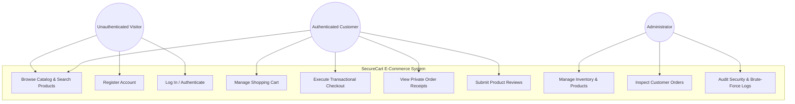
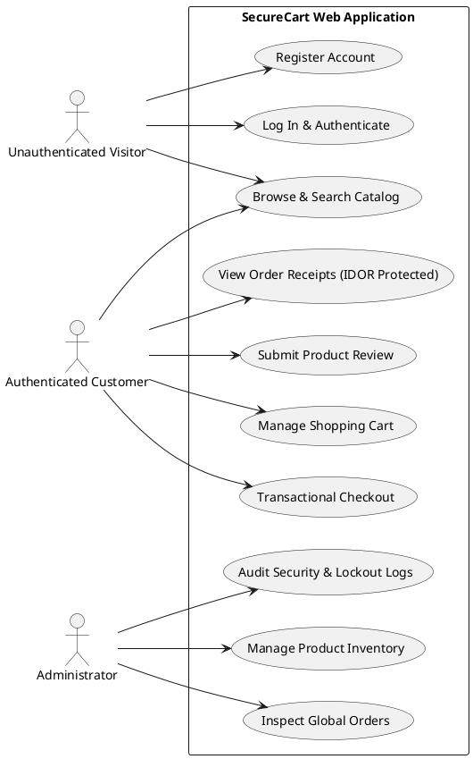
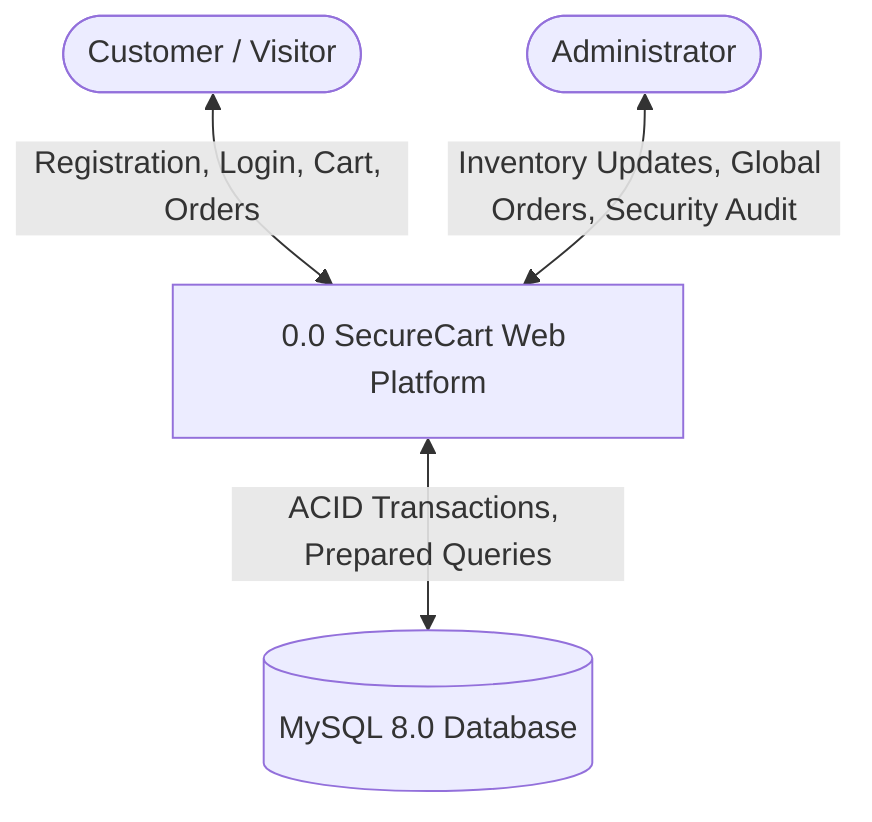
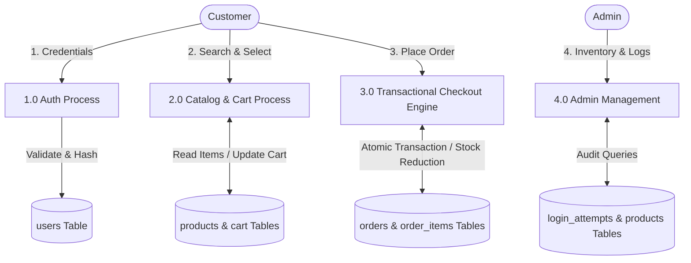
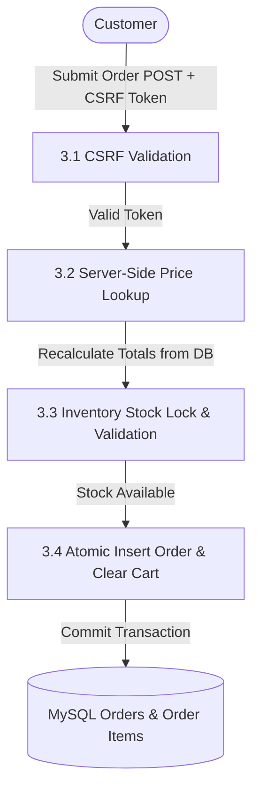
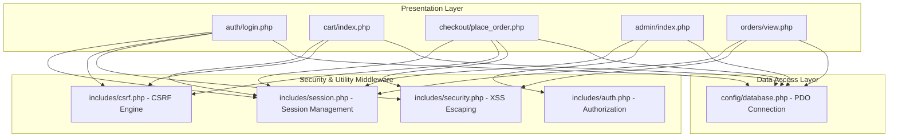

# SecureCart — Diagrams Specification & Visual Models

This document contains the visual architectural diagrams for the **SecureCart** system, formatted in **Mermaid.js**, **PlantUML**, and **Draw.io XML** for easy viewing, editing, and submission.

---

## 1. System Use Case Diagram

The Use Case Diagram illustrates the interactions between system actors (**Customer**, **Administrator**, and **Unauthenticated Visitor**) and the application modules.

### PlantUML Format (Use Case Diagram)

---

## 2. Data Flow Diagrams (DFD)

### Level 0 DFD (Context Diagram)
Shows the high-level data flow between external entities and the SecureCart system boundary.

### Level 1 DFD (Sub-System Process Flow)
Decomposes the system into 4 primary process modules: Authentication, Catalog, Transactional Checkout, and Administration.

### Level 2 DFD (Checkout & Security Process Flow)
Detailing process 3.0 (Transactional Checkout) with OWASP security controls.

---

## 3. Module Connection & Interaction Diagram

Illustrating how presentation modules depend on security middleware and data access layers.

