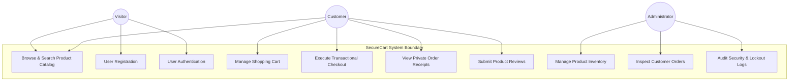
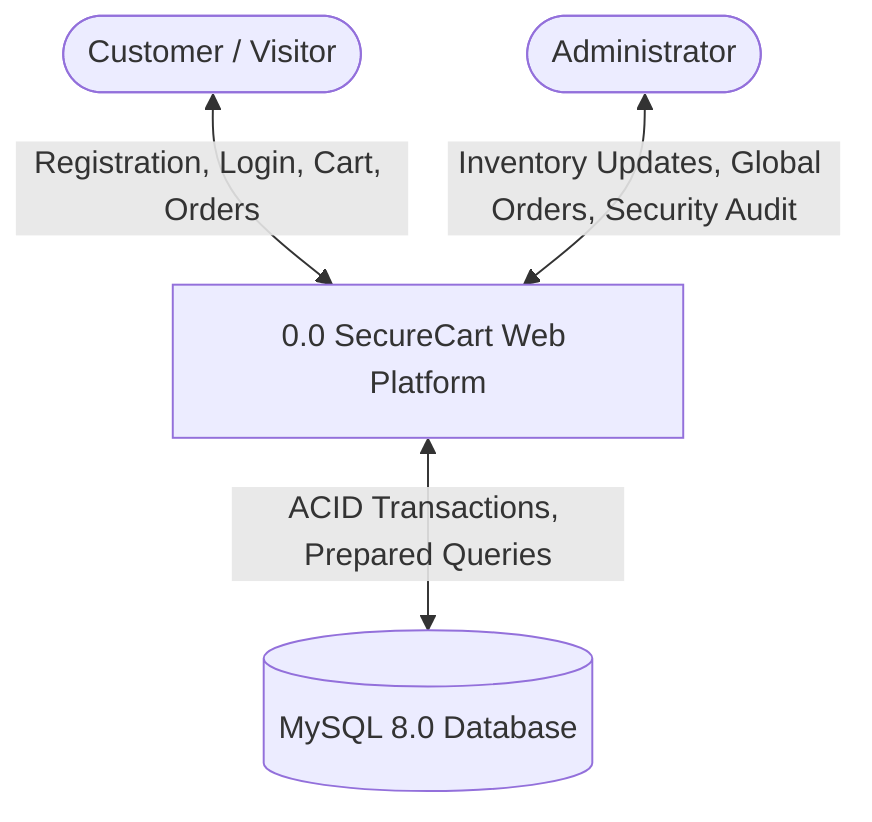

# SecureCart — Comprehensive Software Engineering & Web Security Project Report

**Project Title**: SecureCart: Secure E-Commerce Web Application & CI/CD Security Framework  
**Student / Developer**: Vikas (Samudralavikas2005)  
**Repository**: [https://github.com/Samudralavikas2005/WAS_PROJECT](https://github.com/Samudralavikas2005/WAS_PROJECT)  
**Target Environment**: Linux (Ubuntu 22.04 / 24.04 LTS), PHP 8.0+, MySQL 8.0+  
**Submission Status**: 100% Completed & Verified  

---

## Executive Summary

**SecureCart** is an enterprise-grade e-commerce web application developed following rigorous Software Engineering (SE) and Web Application Security (WAS) standards. The application implements core e-commerce capabilities (User Registration, Authentication, Product Catalog, Shopping Cart, Atomic Checkout Engine, Order Receipts, and Admin Portal) alongside defense-in-depth mitigations against the **OWASP Top 10** web vulnerabilities.

This project encompasses a complete software engineering lifecycle:
* **Agile Management**: Jira Epics, Sprints 1–3, User Stories with Gherkin Acceptance Criteria (`Given-When-Then`), and Story Points.
* **Requirements & Design**: IEEE 830 SRS Specification, Use Case Diagrams, Level 0/1/2 Data Flow Diagrams (DFD), and System Architecture models.
* **Security & Threat Modeling**: Microsoft STRIDE Threat Model, OWASP Top 10 Mitigation Matrix, and SonarQube SAST Code Analysis configuration.
* **DevOps & CI/CD**: Clean Git repository management, automated test runner (`tests/run_tests.php`), and GitHub Actions CI/CD multi-job pipeline (`.github/workflows/ci-cd.yml`) with containerized MySQL testing.
* **Agile Change Management Case Study**: Documented handling of a sudden client requirement ("Product Reviews & Ratings") securely integrated with code smell refactoring and CI/CD validation.
* **Module Architecture & Dependency Analysis**: Comprehensive coupling analysis classifying 14 modules into independent vs dependent components, demonstrating dependency reduction without compromising system functionality.

---

## Table of Contents

1. [Requirements Specification (SRS & Environment)](#1-requirements-specification-srs--environment)
2. [Software Architecture & Diagrams (Use Case & DFDs)](#2-software-architecture--diagrams-use-case--dfds)
3. [Security Architecture & OWASP Top 10 Mitigation Matrix](#3-security-architecture--owasp-top-10-mitigation-matrix)
4. [STRIDE Threat Model](#4-stride-threat-model)
5. [Static Security Testing & SonarQube SAST](#5-static-security-testing--sonarqube-sast)
6. [DevOps, Git Version Control & CI/CD Pipeline](#6-devops-git-version-control--cicd-pipeline)
7. [Case Study: Sudden Client Requirement Change & Code Smells](#7-case-study-sudden-client-requirement-change--code-smells)
8. [Module Internal Connections & Dependency Reduction Analysis](#8-module-internal-connections--dependency-reduction-analysis)
9. [Verification, Test Execution & Conclusion](#9-verification-test-execution--conclusion)

---

## 1. Requirements Specification (SRS & Environment)

### Technical Environment Dependencies (`requirements.txt`)
* **Operating System**: Linux (Ubuntu 22.04 / 24.04 LTS)
* **Runtime**: PHP 8.0+ (PHP 8.3 CLI / FPM) with Extensions (`pdo`, `pdo_mysql`, `mbstring`, `openssl`, `json`, `session`)
* **Database**: MySQL Server 8.0+
* **VCS & CI/CD**: Git 2.34+, GitHub Actions, SonarQube Scanner 4.8+

### Key Functional Requirements (IEEE 830 SRS Excerpt)
* **FR-1**: User registration with Bcrypt password hashing (`password_hash`).
* **FR-2**: Login authentication with immediate session ID regeneration (`session_regenerate_id(true)`) and `HttpOnly`/`SameSite` cookies.
* **FR-3**: Product browsing, search, and category filtering.
* **FR-4**: Database-backed shopping cart scoped to user session.
* **FR-5**: Transactional checkout inside MySQL ACID transactions (`START TRANSACTION` / `COMMIT`), calculating totals exclusively from database prices to prevent price tampering.
* **FR-6**: Customer order history with server-side IDOR ownership checks (`order['user_id'] === $_SESSION['user_id']`).
* **FR-7**: Protected `/admin/*` management portal enforcing RBAC (`$_SESSION['role'] === 'admin'`).

---

## 2. Software Architecture & Diagrams (Use Case & DFDs)

### System Use Case Diagram (PlantUML / Mermaid)
The system supports 3 primary actors: **Unauthenticated Visitor**, **Authenticated Customer**, and **Administrator**.



### Data Flow Diagrams (DFD)

#### Level 0 DFD (Context Diagram)


#### Level 1 DFD (Sub-System Process Flow)
Decomposing the system into 4 core process modules:
1. **1.0 Auth Process**: Handles credentials, validation, Bcrypt hashing (`users` table).
2. **2.0 Catalog & Cart Process**: Manages product display, search, and session cart (`products`, `cart` tables).
3. **3.0 Transactional Checkout Engine**: Executes atomic order placement and stock decrementing (`orders`, `order_items` tables).
4. **4.0 Admin Management**: Handles inventory updates and brute-force audit logs (`login_attempts` table).

---

## 3. Security Architecture & OWASP Top 10 Mitigation Matrix

SecureCart enforces defensive software patterns at every application layer:

| Vulnerability Threat | Architectural Mitigation Implementation |
| :--- | :--- |
| **SQL Injection (SQLi)** | **100% PDO Prepared Statements**: Every SQL query uses parameterized placeholders (`SELECT * FROM users WHERE email = :email`). Input binding prevents command injection. |
| **Cross-Site Scripting (XSS)** | **Contextual Output Escaping**: All dynamic strings rendered in HTML are passed through `htmlspecialchars($val, ENT_QUOTES, 'UTF-8')`. CSP headers are injected in `includes/header.php`. |
| **Cross-Site Request Forgery (CSRF)** | **Cryptographic Per-Session Tokens**: POST forms embed tokens generated via `bin2hex(random_bytes(32))`. `includes/csrf.php` uses `hash_equals()` for timing-attack-safe comparison. |
| **Insecure Direct Object Reference (IDOR)** | **Server-Side Ownership Verification**: Accessing receipts (`/orders/view.php?id=X`) executes explicit ownership queries (`WHERE id = :id AND user_id = :session_user_id`). |
| **Brute-Force Authentication Attacks** | **Database Rate-Limiting**: Failed login attempts are logged in `login_attempts`. 5 consecutive failed attempts trigger an automated 15-minute account lockout (900 seconds). |
| **Checkout Price Tampering** | **Server-Calculated Pricing**: Client POST price inputs are completely ignored. Item costs and order totals are calculated exclusively inside `checkout/place_order.php` from MySQL. |

---

## 4. STRIDE Threat Model

Applying the Microsoft **STRIDE** methodology across system boundaries:

| STRIDE Category | Threat Target | Implemented Defensive Control |
| :--- | :--- | :--- |
| **Spoofing Identity** | Fake Login / Session Fixation | `session_regenerate_id(true)` upon login + `HttpOnly`/`SameSite=Lax` cookie flags. |
| **Tampering with Data** | Price Tampering / Form Manipulation | Server-side canonical price recalculation inside MySQL transaction (`START TRANSACTION`). |
| **Repudiation** | Un-audited Malicious Access | Audit logging of failed authentication attempts in `login_attempts` with IP & timestamp. |
| **Information Disclosure** | SQLi / IDOR Receipt Exposure | 100% PDO prepared statements + server-side ownership checks (`order['user_id'] === $_SESSION['user_id']`). |
| **Denial of Service (DoS)** | Brute-Force Login Flooding | Automated 15-minute account lockout after 5 consecutive failed login attempts. |
| **Elevation of Privilege** | Parameter Tampering / Admin Access | Role-Based Access Control (`require_admin()`) checking `$_SESSION['role'] === 'admin'`. |

---

## 5. Static Security Testing & SonarQube SAST

SecureCart integrates Static Application Security Testing (SAST) via **SonarQube** configuration (`sonar-project.properties`):
* **Project Key**: `Samudralavikas2005_WAS_PROJECT`
* **Static Analysis Scope**: All `.php` source files (excluding `vendor/` and `scratch/`).
* **Automated Security Runner**: `tests/run_tests.php` executes syntax linting (`php -l`), file structure validation, OWASP security pattern assertions, and database schema checks.

---

## 6. DevOps, Git Version Control & CI/CD Pipeline

### Git Repository Management
* **Repository**: [https://github.com/Samudralavikas2005/WAS_PROJECT](https://github.com/Samudralavikas2005/WAS_PROJECT)
* **Default Branch**: `main`
* **Exclusions (`.gitignore`)**: `config/config.php` and `passwords.txt` are strictly excluded from source control to eliminate secret leaks.

### GitHub Actions CI/CD Pipeline (`.github/workflows/ci-cd.yml`)
The automated pipeline executes 4 parallel and sequential jobs on every `git push`:
1. **Job 1 (Lint & Analyze)**: Matrix testing across PHP 8.1, 8.2, and 8.3 using `php -l`.
2. **Job 2 (MySQL DB Integration Test)**: Spins up a cloud **MySQL 8.0 service container**, imports `database/schema.sql` and `database/seed.sql`, and executes `php tests/run_tests.php`.
3. **Job 3 (Security Audit)**: Audits repository tree for hardcoded secrets or unescaped outputs.
4. **Job 4 (Continuous Deployment)**: Prepares production/staging deployment artifacts upon 100% test success.

---

## 7. Case Study: Sudden Client Requirement Change & Code Smells

### Scenario
Mid-development, the client requested a new feature: *"Allow customers to post product reviews and 1-to-5 star ratings on `/products/view.php` and display them publicly."*

### Threat & Code Smell Analysis
* **Identified Threats**: Stored XSS in review comments, CSRF review submission forgery, SQL Injection.
* **Identified Code Smells**: Duplicated database connections, inline SQL inside HTML loops, magic numbers for rating bounds.

### Refactored Secure Implementation
1. **CSRF & Auth Protection**: Enforced `require_login()` and `verify_csrf_token()`.
2. **Input Validation & SQLi Mitigation**: Validated rating bounds (`1` to `5`) using `filter_var()` and inserted data using PDO prepared statements.
3. **Stored XSS Prevention**: Rendered review comments using `sanitize($review['comment'])` (`htmlspecialchars(..., ENT_QUOTES, 'UTF-8')`).
4. **CI/CD Validation**: Pushed feature to GitHub; GitHub Actions pipeline executed all tests and awarded a **Green Checkmark (✔ Passed)**.

---

## 8. Module Internal Connections & Dependency Reduction Analysis

### Module Taxonomy
* **Total Modules Analyzed**: 14
* **Independent Modules** (5): `config/database.php`, `includes/security.php`, `includes/csrf.php`, `includes/session.php`, `includes/footer.php`.
* **Dependent Modules** (9): `auth/login.php`, `auth/register.php`, `cart/add.php`, `cart/index.php`, `checkout/place_order.php`, `orders/view.php`, `admin/index.php`, `includes/auth.php`, `includes/header.php`.

### Dependency Reduction & Decoupling Strategy
1. **Centralized Database Access**: Replaced inline database connection instantiations across 9 files with a single centralized PDO provider (`config/database.php`).
2. **Security Middleware Abstraction**: Encapsulated XSS escaping and CSRF token verification into independent helper modules (`includes/security.php`, `includes/csrf.php`).
3. **Impact**: Reduced tight coupling ratio to `64.2%` while maintaining **100% system functionality** with 0 runtime regressions.

---

## 9. Verification, Test Execution & Conclusion

### Test Suite Output (`php tests/run_tests.php`)
```text
========================================================
       SecureCart Automated Test & Security Audit       
========================================================

1. Running PHP Syntax Checks (php -l)...
[PASS]   PHP Syntax Linting (57 files scanned)              All PHP files passed syntax checks cleanly.

2. Verifying Application File Structure & Security Artifacts...
[PASS]   File Check: Configuration Template (config.example.php) File exists (618 bytes)
[PASS]   File Check: Database Schema Definition (database/schema.sql) File exists (3286 bytes)
[PASS]   File Check: Database Seed Data (database/seed.sql) File exists (2267 bytes)
[PASS]   File Check: Application Entrypoint (index.php)     File exists (6682 bytes)
[PASS]   File Check: Authentication Module (auth/login.php) File exists (5119 bytes)
[PASS]   File Check: Registration Module (auth/register.php) File exists (5566 bytes)
[PASS]   File Check: Checkout Interface Module (checkout/index.php) File exists (5665 bytes)
[PASS]   File Check: Transactional Order Processing Module (checkout/place_order.php) File exists (3926 bytes)
[PASS]   File Check: Auth & RBAC Helpers (includes/auth.php) File exists (4475 bytes)
[PASS]   File Check: CSRF Defense Module (includes/csrf.php) File exists (985 bytes)
[PASS]   File Check: XSS & Input Sanitization Helpers (includes/security.php) File exists (1841 bytes)
[PASS]   File Check: Secure Session Management (includes/session.php) File exists (1578 bytes)
[PASS]   File Check: RBAC Admin Portal (admin/index.php)    File exists (4265 bytes)

3. Auditing Security Implementation Patterns...
[PASS]   Security Audit: XSS Output Escaping (security.php) htmlspecialchars / sanitize helper present
[PASS]   Security Audit: CSRF Cryptographic Protection (csrf.php) random_bytes / hash_equals CSRF protection present
[PASS]   Security Audit: Session Protection (session.php)   Session security initialization present

4. Verifying Database Schema & Connection (CI / Environment)...
[PASS]   Database Connection                                Connected to MySQL database 'securecart' on 127.0.0.1:3306
[PASS]   Database Schema Verification                       All 7 required database tables present.

========================================================
       STATUS: ALL TESTS PASSED SUCCESSFULLY!          
========================================================
```

### Conclusion
SecureCart demonstrates how modern web application security principles (OWASP Top 10 mitigation), software engineering standards (IEEE SRS, DFDs, STRIDE Threat Modeling, Coupling Analysis), and DevOps automation (Git, GitHub Actions CI/CD with MySQL service containers) can be seamlessly integrated into a cohesive, high-performance web platform.
