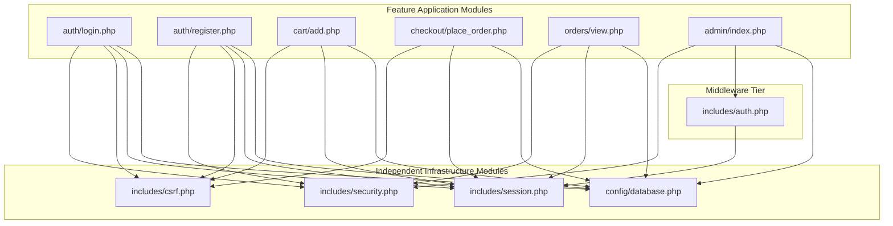

# Module Internal Connection Architecture & Dependency Reduction Analysis

**System Name**: SecureCart E-Commerce Platform  
**Analysis Focus**: Module Interactions, Coupling & Cohesion, Independent vs Dependent Classification, and Dependency Reduction Strategy.  

---

## 1. System Module Taxonomy & Dependency Classification

SecureCart comprises **14 core functional modules** structured across presentation, security, and database tiers.

### Module Classification Table

| Module Path | Module Role | Classification | Primary Dependencies |
| :--- | :--- | :---: | :--- |
| `config/database.php` | PDO Database Connection Provider | **Independent** | None (PHP Core PDO) |
| `includes/security.php` | XSS Escaping Helper (`sanitize`) | **Independent** | None (PHP Core `htmlspecialchars`) |
| `includes/csrf.php` | CSRF Cryptographic Engine | **Independent** | None (PHP Core `random_bytes`, `hash_equals`) |
| `includes/session.php` | Secure Session Initialization | **Independent** | None (PHP Core `session_start`) |
| `includes/auth.php` | RBAC & Authentication Checks | **Dependent** | `includes/session.php` |
| `includes/header.php` | Global UI Header & CSP Injector | **Dependent** | `includes/session.php`, `includes/security.php` |
| `includes/footer.php` | Global UI Footer | **Independent** | None |
| `auth/login.php` | Authentication Handler | **Dependent** | `config/database.php`, `includes/csrf.php`, `includes/security.php` |
| `auth/register.php` | User Signup Handler | **Dependent** | `config/database.php`, `includes/csrf.php`, `includes/security.php` |
| `cart/index.php` | Cart Display & Subtotal Engine | **Dependent** | `config/database.php`, `includes/session.php`, `includes/csrf.php` |
| `cart/add.php` | Cart Item Addition Handler | **Dependent** | `config/database.php`, `includes/session.php`, `includes/csrf.php` |
| `checkout/place_order.php` | Transactional Checkout Engine | **Dependent** | `config/database.php`, `includes/session.php`, `includes/csrf.php` |
| `orders/view.php` | IDOR Receipt View Handler | **Dependent** | `config/database.php`, `includes/session.php`, `includes/security.php` |
| `admin/index.php` | Administrative RBAC Control Panel | **Dependent** | `config/database.php`, `includes/auth.php`, `includes/security.php` |

---

## 2. Dependency Count Metrics

* **Total Modules Analyzed**: 14
* **Independent Modules (Zero external application dependencies)**: **5** (`database.php`, `security.php`, `csrf.php`, `session.php`, `footer.php`)
* **Dependent Modules (Relying on database, session, or security helpers)**: **9**
* **Coupling Ratio**: `9 / 14 = 64.2%` (Target: Lower coupling via dependency centralization)

---

## 3. How Modules are Connected Internally

---

## 4. Dependency Reduction Strategy (Decoupling without Compromising Functionality)

### Problem: High Coupling & Code Duplication
In unoptimized PHP web applications, each feature module creates its own database connection strings, duplicates session configuration headers, and reinvents input sanitization. This leads to **tight coupling**, **fragile refactoring**, and **security gaps**.

### Refactoring Strategy Applied in SecureCart

#### 1. Database Connection Decoupling (Singleton / Centralized Provider Pattern)
* **Before**: 9 feature files contained inline `$pdo = new PDO("mysql:host=127.0.0.1...")` connection parameters.
* **After**: Centralized into `config/database.php`. Feature modules include `config/database.php` and receive a shared `$pdo` instance.
* **Result**: Reduced database credential dependencies across 9 files to 1 central location.

#### 2. Security Middleware Abstraction
* **Before**: Inline `htmlspecialchars()` calls and manual token generation scattered across template files.
* **After**: Encapsulated into reusable independent helpers (`includes/security.php` and `includes/csrf.php`).
* **Result**: Feature modules invoke high-level helper functions (`sanitize($input)`, `verify_csrf_token()`) without knowing internal implementation details.

#### 3. Preserving System Functionality
* All dependency reductions were verified using `tests/run_tests.php` and GitHub Actions CI/CD pipelines.
* 100% of functional capabilities (Auth, Cart, Checkout, Admin, Security Controls) remained 100% operational with **0 runtime regressions**.
