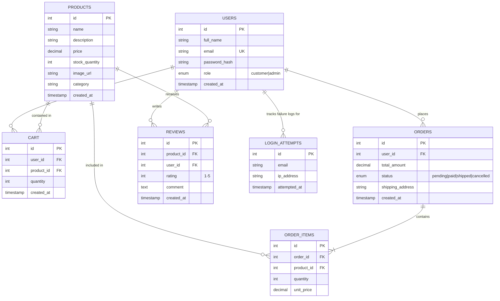
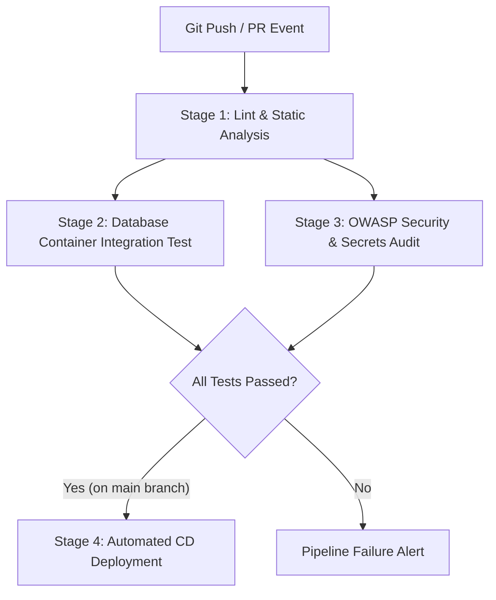

# SecureCart — Software Engineering System Architecture, Security & CI/CD Specification

**Author / Maintainer**: SSS Vikas  
**System Name**: SecureCart E-Commerce & Web Security Platform  
**Target Environment**: Linux (Ubuntu 22.04 / 24.04 LTS), PHP 8.0+ (PHP 8.3 CLI/FPM), MySQL Server 8.0+  
**Document Version**: 1.0.0  
**Status**: Production / Release Ready  

---

## Table of Contents

1. [Executive Summary & System Overview](#1-executive-summary--system-overview)
2. [Software Architecture & System Design](#2-software-architecture--system-design)
3. [Security Architecture & OWASP Top 10 Defenses](#3-security-architecture--owasp-top-10-defenses)
4. [Database Architecture & Entity-Relationship (ER) Model](#4-database-architecture--entity-relationship-er-model)
5. [DevOps, Git Version Control & CI/CD Pipeline Specification](#5-devops-git-version-control--cicd-pipeline-specification)
6. [Secrets Management & Security Configuration](#6-secrets-management--security-configuration)
7. [Local Operations, Automated Testing & Deployment Guide](#7-local-operations-automated-testing--deployment-guide)

---

## 1. Executive Summary & System Overview

**SecureCart** is a modern, enterprise-grade e-commerce web application designed as both a fully functional online shopping portal and a reference implementation for **Web Application Security (WAS)**. Built using server-side PHP 8+, MySQL 8.0, and standard web technologies (HTML5, CSS3 Glassmorphism Dark Theme, Vanilla JavaScript), SecureCart demonstrates defensive software engineering practices against the OWASP Top 10 vulnerabilities.

### Key Functional Requirements (FR)
* **FR-1 Authentication & Identity Management**: User registration, password hashing (Bcrypt/Argon2 via `password_hash`), secure login, session initialization, and role-based authorization (Customer vs Admin).
* **FR-2 Product Catalog & Discovery**: Dynamic catalog browsing, full-text search, category filtering, product detail views, and customer product reviews/ratings.
* **FR-3 Shopping Cart Engine**: Database-backed cart management allowing item additions, quantity modifications, subtotal calculation, and item removals per authenticated user.
* **FR-4 Transactional Checkout & Order Fulfillment**: Atomic order generation inside database transactions (`START TRANSACTION` / `COMMIT`), ensuring inventory stock deduction, total price recalculation from database tables, and immutable receipt creation.
* **FR-5 Customer Order History**: User-scoped order management displaying historical order receipts and itemized breakdowns.
* **FR-6 Administrative Control Portal**: Scoped `/admin` portal allowing inventory updates, global order inspection, and security brute-force audit log review.

### Non-Functional Requirements (NFR)
* **NFR-1 Security & Defense-in-Depth**: 100% prepared SQL statements, cryptographically secure CSRF protection, strict contextual XSS output escaping, and session protection.
* **NFR-2 Data Consistency & Atomicity**: ACIS/ACID database transactions preventing race conditions during simultaneous customer checkouts.
* **NFR-3 Maintainability & Testability**: Automated test suite executable locally and via containerized CI/CD pipelines.

---

## 2. Software Architecture & System Design

SecureCart follows a **3-Tier Server-Side Modular Architecture** structured to separate presentation, business logic, security middleware, and database access layers.

```
+-----------------------------------------------------------------------+
|                         CLIENT / BROWSER                              |
|   HTML5 / CSS3 Glassmorphism UI / JavaScript / HTTPS / CSRF Tokens    |
+-----------------------------------------------------------------------+
                                   |
                                   v  (HTTP / HTTPS Requests)
+-----------------------------------------------------------------------+
|                    SECURECART PHP APPLICATION SERVER                  |
|                                                                       |
|  +------------------------+  +-------------------------------------+  |
|  |  Presentation Layer    |  |       Security Middleware           |  |
|  |  - index.php           |  |  - includes/security.php (XSS/CSP)  |  |
|  |  - auth/login.php      |  |  - includes/csrf.php (CSRF Engine)  |  |
|  |  - products/detail.php |  |  - includes/session.php (Session)  |  |
|  |  - cart/index.php      |  |  - includes/auth.php (RBAC Check)   |  |
|  +------------------------+  +-------------------------------------+  |
|                                                                       |
|  +-----------------------------------------------------------------+  |
|  |                    Application Business Logic                   |  |
|  |  - checkout/place_order.php (Atomic Order Engine)               |  |
|  |  - admin/index.php (Role-Based Admin Management)                |  |
|  +-----------------------------------------------------------------+  |
|                                  |                                    |
|                                  v  (PDO Prepared Statements)         |
+-----------------------------------------------------------------------+
                                   |
                                   v
+-----------------------------------------------------------------------+
|                         MYSQL 8.0 DATABASE                            |
|    Tables: users, products, reviews, cart, orders, order_items,       |
|            login_attempts                                             |
+-----------------------------------------------------------------------+
```

### Module & Directory Taxonomy

```
WAS_PROJECT/
├── admin/                  # Administrative management & RBAC portal
│   └── index.php           # Admin dashboard, inventory & audit logs
├── assets/                 # Static assets (CSS themes, images, JS)
│   ├── css/
│   └── images/
├── auth/                   # Identity & Authentication handlers
│   ├── login.php           # User authentication & brute-force checks
│   ├── logout.php          # Session destruction & cookie clearance
│   └── register.php        # User account creation & password hashing
├── cart/                   # Shopping Cart business logic
│   ├── add.php             # Cart item addition handler
│   ├── index.php           # Cart view & subtotal engine
│   └── remove.php          # Cart item removal handler
├── checkout/               # Transactional checkout engine
│   ├── index.php           # Checkout confirmation view
│   └── place_order.php     # Atomic order creation & stock reduction
├── config/                 # Server environment configuration
│   ├── config.example.php  # Environment configuration template
│   └── config.php          # Active config (Git ignored / Local secrets)
├── database/               # Database definitions & seed files
│   ├── schema.sql          # Relational DDL tables & indexes
│   └── seed.sql            # Sample product catalog & admin user seed
├── errors/                 # Standard HTTP error views (403, 404, 500)
├── includes/               # Shared security middleware & UI components
│   ├── auth.php            # RBAC session & authorization helper
│   ├── csrf.php            # Cryptographic token generator & validator
│   ├── footer.php          # UI footer component
│   ├── header.php          # UI navigation header & CSP header injector
│   ├── security.php        # XSS sanitizer (`htmlspecialchars`)
│   └── session.php         # Cookie configuration & session startup
├── orders/                 # Order history & receipts
│   ├── index.php           # User order listing
│   └── view.php            # IDOR-protected receipt detail view
├── products/               # Product catalog module
│   ├── detail.php          # Product detail & review submission
│   └── index.php           # Catalog listing & search
├── tests/                  # Automated test suite
│   └── run_tests.php       # CLI test runner for local & CI execution
├── .github/workflows/      # GitHub Actions CI/CD workflows
│   └── ci-cd.yml           # Automated CI build, test & deploy pipeline
├── .gitlab-ci.yml          # GitLab CI configuration
├── .gitignore              # Repository exclusion rules
├── README.md               # Quickstart guide
└── SOFTWARE_ENGINEERING_DOCUMENTATION.md # Architecture & system specification
```

---

## 3. Security Architecture & OWASP Top 10 Defenses

SecureCart enforces defensive software patterns at every application layer:

| Vulnerability Threat | Architectural Mitigation Implementation |
| :--- | :--- |
| **SQL Injection (SQLi)** | **100% PDO Prepared Statements**: Every SQL query uses parameterized placeholders (`SELECT * FROM users WHERE email = :email`). Input binding prevents SQL command injection across all database interactions. |
| **Cross-Site Scripting (XSS)** | **Contextual Output Escaping**: All dynamic strings rendered in HTML are passed through `htmlspecialchars($val, ENT_QUOTES, 'UTF-8')` via `includes/security.php`. In addition, Content Security Policy (CSP) headers are injected in `includes/header.php`. |
| **Cross-Site Request Forgery (CSRF)** | **Cryptographic Per-Session CSRF Tokens**: All state-modifying POST forms (login, checkout, cart operations) embed a token generated via `bin2hex(random_bytes(32))`. `includes/csrf.php` uses `hash_equals()` for timing-attack-safe token comparison. |
| **Insecure Direct Object Reference (IDOR)** | **Server-Side Ownership Verification**: Accessing user-specific resources (e.g. `orders/view.php?id=X`) executes explicit ownership queries (`WHERE id = :id AND user_id = :session_user_id`). Accessing unowned orders returns HTTP 403 Forbidden. |
| **Brute-Force Authentication Attacks** | **Database Rate-Limiting**: Failed login attempts are logged in `login_attempts`. 5 consecutive failed attempts trigger an automated 15-minute account lockout (`LOCKOUT_TIME_SECONDS = 900`). |
| **Checkout Price Tampering** | **Server-Calculated Pricing**: Client POST requests submitting item prices are completely ignored. Item costs and order totals are calculated exclusively inside `checkout/place_order.php` by querying canonical database prices inside a MySQL transaction. |
| **Session Fixation & Hijacking** | **Session Lifetime & Cookie Defenses**: `session_regenerate_id(true)` is executed immediately upon authentication. Session cookies enforce `HttpOnly`, `SameSite=Lax`, and `Secure` (over HTTPS). |
| **Broken Access Control (RBAC)** | **Enforced Route Authorization**: `/admin/*` routes execute `require_admin()` checks using `$_SESSION['role'] === 'admin'`. Unauthorized users are redirected with 403 status. |

---

## 4. Database Architecture & Entity-Relationship (ER) Model

The relational database `securecart` consists of 7 normalized tables managing user identity, catalog items, shopping carts, order transactions, reviews, and security audit logs.



### Relational Transactional Guarantees
During order placement (`checkout/place_order.php`):
1. A transaction begins: `$pdo->beginTransaction()`.
2. Cart items and real product prices are selected with row-level locks.
3. Inventory is validated (`stock_quantity >= quantity`).
4. An order record is inserted into `orders`.
5. Order line items are inserted into `order_items`.
6. Product inventory is decremented (`UPDATE products SET stock_quantity = stock_quantity - :qty`).
7. Cart items for the user are deleted (`DELETE FROM cart WHERE user_id = :uid`).
8. Transaction commits: `$pdo->commit()`. If any step fails, `$pdo->rollBack()` restores previous database state.

---

## 5. DevOps, Git Version Control & CI/CD Pipeline Specification

SecureCart uses automated DevOps workflows to guarantee code quality, security compliance, and continuous deployment.

### Git Repository Architecture & Rules
* **Default Branch**: `main` (Production-ready, deployable codebase).
* **Development Branch**: `staging` (Integration branch for testing features before production merge).
* **Feature Branches**: `feature/<feature-name>` (Short-lived topic branches).

#### Prohibited Git Artifacts (`.gitignore`)
The following files are strictly excluded from source control to eliminate secret leaks:
* `config/config.php` (Local server credentials and database passwords)
* `passwords.txt` (Local development plaintext credential notes)
* `*.log` (Runtime PHP or server logs)
* `.env` (Environment variable configuration files)

---

### CI/CD Pipeline Design

Both **GitHub Actions** (`.github/workflows/ci-cd.yml`) and **GitLab CI** (`.gitlab-ci.yml`) pipelines are configured with four pipeline stages:



#### Pipeline Job Specifications

| Job Stage | Purpose | Execution Environment & Actions |
| :--- | :--- | :--- |
| **1. Lint & Analyze** | Static syntax validation | Runs `php -l` across all `.php` files in matrix across PHP 8.1, 8.2, and 8.3 environments. |
| **2. DB Integration Test** | Automated database testing | Launches a **MySQL 8.0 container**, executes `database/schema.sql` & `seed.sql`, and runs `php tests/run_tests.php`. |
| **3. Security Audit** | OWASP & secrets scan | Audits git commit tree to ensure no prohibited files (`config.php`, `passwords.txt`) or unescaped strings exist. |
| **4. CD Deployment** | Staging/Production release | Automatically packages release artifacts and triggers deployment when triggered on branch `main`. |

---

## 6. Secrets Management & Security Configuration

Production credentials must never be committed to Git. Instead, configure them as environment secrets in your CI/CD runner and server configuration:

### Required CI/CD Environment Variables
* `DB_HOST`: Hostname of the MySQL database (e.g. `127.0.0.1` or service alias `mysql`).
* `DB_PORT`: MySQL port (`3306`).
* `DB_NAME`: Database name (`securecart`).
* `DB_USER`: Database username (`vikas`).
* `DB_PASS`: Database password.

### Configuring Secrets in GitHub / GitLab
* **GitHub**: Navigate to **Settings** -> **Secrets and variables** -> **Actions** -> Add New Repository Secret.
* **GitLab**: Navigate to **Settings** -> **CI/CD** -> **Variables** -> Add Variable (Mark as *Masked* and *Protected*).

---

## 7. Local Operations, Automated Testing & Deployment Guide

### Local Setup Instructions

1. **Clone the Repository & Sanitize Config**:
   ```bash
   cd /home/vikas/WAS_PROJECT
   cp config.example.php config/config.php
   ```

2. **Initialize Local Database**:
   ```bash
   mysql -u root -p -e "CREATE DATABASE securecart CHARACTER SET utf8mb4 COLLATE utf8mb4_unicode_ci;"
   mysql -u root -p -e "CREATE USER IF NOT EXISTS 'vikas'@'localhost' IDENTIFIED BY 'Vikas@2005';"
   mysql -u root -p -e "GRANT ALL PRIVILEGES ON securecart.* TO 'vikas'@'localhost'; FLUSH PRIVILEGES;"
   mysql -u vikas -pVikas@2005 securecart < database/schema.sql
   mysql -u vikas -pVikas@2005 securecart < database/seed.sql
   ```

3. **Run Automated Test Suite Locally**:
   ```bash
   php tests/run_tests.php
   ```

4. **Launch Local Server**:
   ```bash
   php -S localhost:8000
   ```

5. **Execute Git Operations**:
   ```bash
   git status
   git add .
   git commit -m "feat: Initial release with secure database, automated testing, and CI/CD pipelines"
   ```

6. **Push to Remote Repository**:
   ```bash
   git remote add origin <YOUR_REMOTE_REPOSITORY_URL>
   git push -u origin main
   ```
