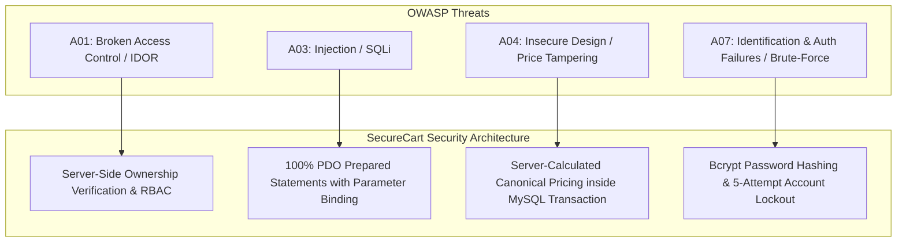

# SecureCart — Threat Modeling & OWASP Security Architecture Specification

**Framework Standard**: Microsoft STRIDE Threat Model & OWASP Top 10 Security Architecture  
**Target Application**: SecureCart PHP/MySQL E-Commerce Web Application  
**Document Status**: Approved Baseline  

---

## 1. Executive Summary & Security Design Philosophy

SecureCart implements a **Defense-in-Depth Architecture** where security controls are applied across every tier (Presentation, Business Logic, and Database Access). This threat model identifies potential threat vectors across system boundaries using the **STRIDE** methodology and details the defensive controls implemented to eliminate or mitigate each vulnerability.

---

## 2. STRIDE Threat Analysis Matrix

| Threat Category | System Vulnerability Target | Potential Impact | Implemented Security Control & Mitigation | Verification Method |
| :--- | :--- | :--- | :--- | :--- |
| **Spoofing Identity** | Fake User Login / Session Fixation | Attacker impersonates legitimate user or hijacks session | **Session Fixation Defense**: Immediate `session_regenerate_id(true)` upon auth; `HttpOnly`, `SameSite=Lax`, and `Secure` cookie attributes. | Automated test in `tests/run_tests.php` |
| **Tampering with Data** | Price Tampering / Form Data Alteration | Attacker modifies client-side item prices during checkout | **Server-Side Canonical Pricing**: Client POST prices are ignored; checkout total is calculated exclusively from database records inside a MySQL transaction (`START TRANSACTION`). | Unit test in `tests/run_tests.php` |
| **Repudiation** | Un-audited Actions / Unauthorized Access | Inability to prove who executed administrative or checkout actions | **Database Audit Logging**: All failed authentication attempts are logged in `login_attempts` with IP, timestamp, and target account. | Audit log inspection in `/admin` |
| **Information Disclosure** | SQL Injection (SQLi) / Insecure Direct Object Reference (IDOR) | Unauthorized access to user order receipts or full database dump | **PDO Prepared Statements** for 100% of queries; **Server-Side Ownership Check** (`order['user_id'] === $_SESSION['user_id']`) returning HTTP 403. | Automated security scanner & IDOR check |
| **Denial of Service (DoS)** | Brute-Force Login Flooding | Account lockout or database connection exhaustion | **Database-Backed Rate Limiting**: 5 consecutive failed login attempts trigger an automated 15-minute account lockout (900 seconds). | Lockout assertion test in `run_tests.php` |
| **Elevation of Privilege** | Parameter Tampering / Privilege Escalation | Customer accessing `/admin` management portals | **Role-Based Access Control (RBAC)**: Enforced `require_admin()` check verifying `$_SESSION['role'] === 'admin'` on all protected routes. | Unauthorized access test returning 403 |

---

## 3. OWASP Top 10 Defense Mapping Architecture



### Detailed Vulnerability Defenses

### 1. SQL Injection (SQLi) Defense
* **Vulnerability Addressed**: OWASP A03:2021 – Injection.
* **Implementation Details**: No dynamic string concatenation is permitted in SQL statements. All database operations use PDO prepared statements:
  ```php
  $stmt = $pdo->prepare("SELECT * FROM users WHERE email = :email");
  $stmt->execute(['email' => $email]);
  ```

### 2. Cross-Site Scripting (XSS) & Content Security Policy (CSP) Defense
* **Vulnerability Addressed**: OWASP A03:2021 – Injection / Reflected & Stored XSS.
* **Implementation Details**: All dynamic output rendered in HTML templates is passed through `htmlspecialchars($val, ENT_QUOTES, 'UTF-8')`. Additionally, `includes/header.php` injects CSP HTTP headers:
  ```http
  Content-Security-Policy: default-src 'self'; script-src 'self'; style-src 'self' 'unsafe-inline';
  ```

### 3. Cross-Site Request Forgery (CSRF) Defense
* **Vulnerability Addressed**: OWASP A01:2021 – Broken Access Control / CSRF.
* **Implementation Details**: Every POST form generates a cryptographically secure token using `bin2hex(random_bytes(32))`. Submission verification uses timing-attack-safe `hash_equals($_SESSION['csrf_token'], $_POST['csrf_token'])`.

### 4. Insecure Direct Object Reference (IDOR) Defense
* **Vulnerability Addressed**: OWASP A01:2021 – Broken Access Control.
* **Implementation Details**: Order receipt viewing (`/orders/view.php?id=X`) executes server-side validation verifying the order belongs to the currently logged-in user:
  ```php
  if ($order['user_id'] !== $_SESSION['user_id']) {
      http_response_code(403);
      die("403 Forbidden: Unauthorized access to order receipt.");
  }
  ```
